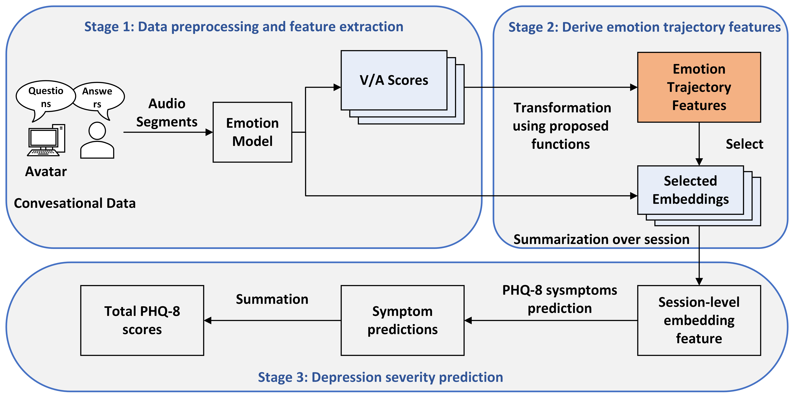

# Emotion-Trajectory-Driven Segment Selection for Depression Severity Prediction

  

## Details

This project is about Emotion-Trajectory-Driven Segment Selection for Depression Severity Prediction, which is an extension of our previous work "[Using Emotionally Rich Speech Segments for Depression Prediction](https://ieeexplore.ieee.org/abstract/document/10889722)". [This project's code](https://github.com/CSerV/EmotionallyRich) is also available. 

## Abstract

Within speech-based depression prediction systems that incorporate emotion cues, emotion is often treated as static aggregates, overlooking the local dynamics/trajectory of emotion within an interview. Motivated by research in psychology, we address this gap by introducing mathematical formulations to extract acoustic emotion-trajectory features and propose to use them for acoustic segment selection. 
We conduct comprehensive experiments on E-DAIC depression corpus, which is known to be challenging for acoustics-based modeling, adhering to the AVEC 2019 competition protocol. Our best model on the development set reaches {0.522 CCC / 4.84 RMSE}, yielding an absolute {+0.015 CCC} over the strongest prior acoustic-only approach. On the test set, we attain 0.493 CCC / 5.37 RMSE, improving CCC by +0.013 and reducing RMSE by 0.21 over the state-of-the-art. Symptom-level analyses show merits of the proposed acoustics-based trajectory features in capturing symptom-relevant linguistic content.
These encouraging results motivate broader use of emotion-trajectory-driven selection, not only for depression severity prediction but also
speech-centered mental-health assessment in a more interpretable manner.

## Usage
First, using codes in utils folder to extract the PDEM embeddings and corresponding AV scores, using the [public dimensional emotion model](https://github.com/audeering/w2v2-how-to). The scripts `1_extract_AVD_scores_from_PDEM.py` and `2_extract_embedding_from_PDEM.py` in the *utils* folder can be used as references. 

Then, you can follow the scripts in the *train_andtest* folder to train and test the model using your own data.

<!-- ## Results and Analysis -->

## Citation
